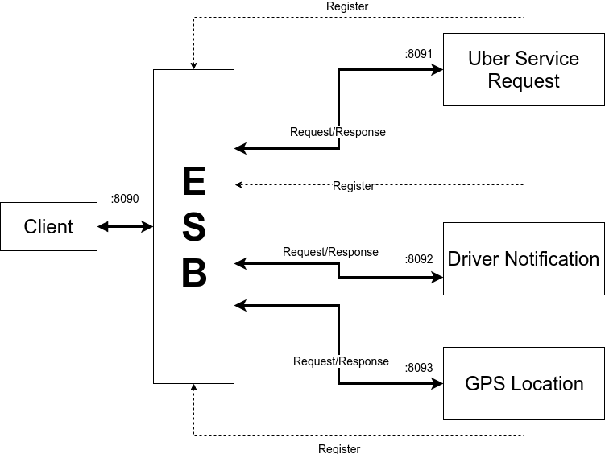

# Software Avanzado
## Tarea 2 y 3
### Rainman Sián - **200815284**

This project has been implemented using Spring Boot

## Video
https://youtu.be/0zSMdGpKoB8

## Diagram

All microservices runs in their own port. for example:

* http://localhost:8091/uber-service-request/list
* http://localhost:8092/uber-driver-notification/list
* http://localhost:8093/uber-gps-location-request/list

And the ESB runs on the port 8090

* http://localhost:8090/esb/services

When the microservices starts they do a POST to the ESB with their information such as an id, a name, a description, the host, the port and all the methods (and their params) that the services have.

Once the services are registered they are available through the path `/esb/services/` and then place the original service path and the service name. For example:

* http://localhost:8090/esb/service/uber-service-request/list
* http://localhost:8090/esb/service/uber-driver-notification/list
* http://localhost:8090/esb/service/uber-gps-location-request/list

